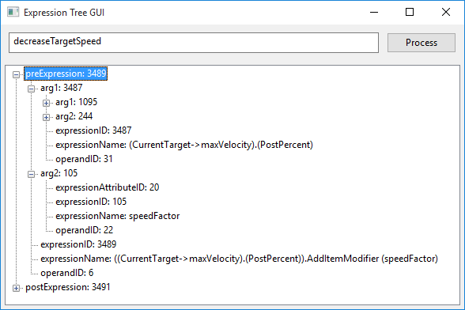
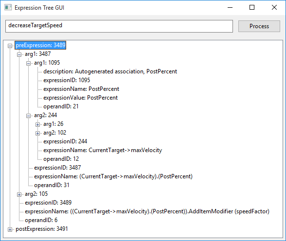
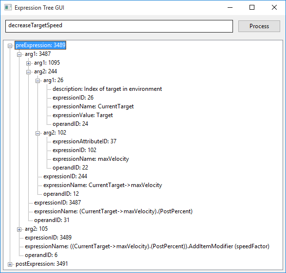
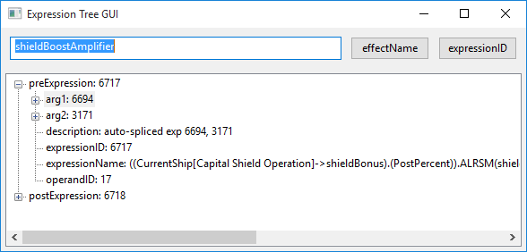
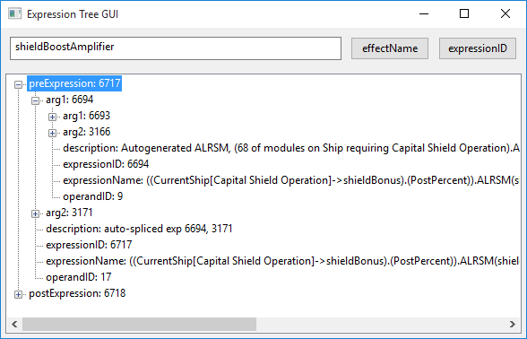
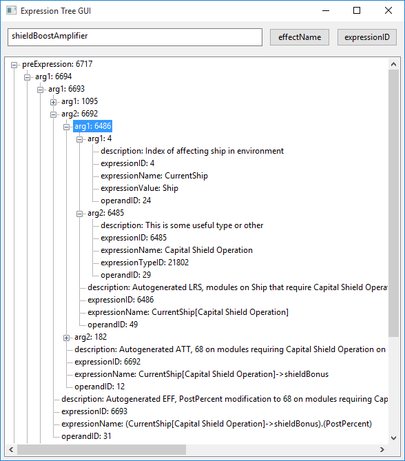

# Introduction

In this document, I will (try to) explain how the Dogma system works for EVE Online for the purposes of fit calculations. I will be using fitting calculation engine EOS to reference things that are not published by CCP, namely `operandID`s and their meaning, as well as the operators. These references can be found as constants in the EOS project: [EVE](https://github.com/DarkFenX/Eos/blob/8d8af6/const/eve.py#L214) and [EOS](https://github.com/DarkFenX/Eos/blob/8d8af6/const/eos.py) constants. These constants may or may not be included in future documentation.

Additionally, I may refer to attributes in the form of `attrID:attrName` for simplicity.

Finally, I have produced a simple GUI that may be helpful when learning about Dogma expressions. Screenshots will be used in this document to visually assist with understanding the expression tree. For releases of this program, please see [exp-gui](https://github.com/blitzmann/exp-gui/releases).

## What is Dogma?

At its core, Dogma is the system for managing all the attributes and modifying effects for the various items in EVE. Before we explain how Dogma works, we need to first understand items and effects. Items are the building blocks of EVE - everything in the game is an item. The modules that you put on your ship, the charges you load into your guns, and your ship itself. Items can also be non-physical entities such as system-wide wormhole effects or the tactical destroyer mode. Everything in EVE that has some sort of attribute attached to it is an item, and these are defined in the `invTypes` table.

But having a bunch of items with attributes is useless without a way for them to affect one another. That's where effects come in. Effects are the building blocks of items and are what actually make an item do something. Suppose you fit a Webifier to your ship. When it's active, it applies its `decreaseTargetSpeed` effect to the currently locked target. When it's overloaded, it applies its `overloadSelfRangeBonus` effect to itself. Effects have a many-to-many relationship with items, where each effect may have be attached to many different items, and each item may have many different effects. Effects are defined in the `dgmEffects` table, whereas the relationship with items is defined with the `dgmTypeEffects` table. 

Each effect (usually) has one or more modifiers which ultimately what is used in the calculations. 

So now that we know what items and effects are, how do we apply one item's effects to another item? We must create a modifier, of which each effect (usually) has one or more of, and to do this we need to know a few things (for simplicity, there are a couple points omitted): 

1. The source attribute
2. The target (or location)
3. The target attribute
4. The operation / modifier
5. The filter

For example, we have a Stasis Web II and are applying it to our target. The web module itself has an attribute that determines the penalty it deals, and this attribute is `20:speedFactor` with a value of `-60.0`. This is our source attribute (the source attribute is always attached to the item that is calling the effect in question, in this case the Web II).  The target attribute is `37:maxVelocity` with the target being `CurrentTarget` (which is CCP's definition of the currently locked and selected target). It is best to note here that if we are modifying an attribute that is not on the ship itself, but on another item, this would refer to where that item might be located (eg: current ship, current target, gang members, etc). The modifier is `PostPercent`, which basically tells us to apply our source attribute as a percentage to the target attribute. 

The last point, the filter, is not applicable to our specific example, but is used in a lot of other effects. This is used to limit the effect to specific item groups, based on the group of the item or the required skill of the item. For example, the `durationBonusForGroupAfterburner` effect used to reduce duration of AB and MWDs (used with the Engine Thermal Shielding rigs). Instead of applying them to all our modules (which doesn't make sense), we need to filter out modules that share the "Afterburner" group, which is all Afterburners and MWD's.

We have an enemy Retribution currently locked and selected and it has with a max velocity of 348m/s. We convert our source attribute value, `-60.0`, to a percentage modifier (defined with `PostPercent = val / 100 + 1`)<a name="footnote-1-return" href='#footnote-1'>1</a> and we get `0.4`. This is then multiplied with the target attribute to get the final value of `348 * 0.4 = 139.2m/s`. And that's how effects work.

So now you know what you should be looking for. How do you get it?

## The Easy Way: `modifierInfo`

**Note:** more documentation on the various operators and functions need to be written.

CCP has recently started to move in a new direction with their effects, storing the modifier data in the effects `modifierInfo` field rather than in the expression tree. This is a YAML formatted field, and typically looks like this (from the `shipModeMaxTargetRangePostDiv` effect):

    - domain: shipID
      func: ItemModifier
      modifiedAttributeID: 76
      modifyingAttributeID: 1991
      operator: 5

From this you can easily see the attributes that are involved. The `operator` used is 5, which is defined as PostDiv. `func` determines the kind of modification we are performing - is it simply a direct modification from attribute to attribute (like `ItemModifier`), or is there a filter that is being applied (like `LocationGroupModifier`). In this case, no filter is being applied. The `domain` tells us what our target is, in this case it's our own ship. Please note that `modifierInfo` is relatively new, and there isn't yet a lot of variety. For example, to my knowledge, there aren't any projected effect (effects that are projected to something other than your own ship or character) that utilize the `modifierInfo` format, and thus this may change in the future. 

## The Legacy Way: `dgmExpressions`

The way CCP originally defined effects was the use of expressions. Each effect contains two references to expressions: `preExpression` and `postExpression`. The `preExpression` is used when an effect is applied (ie: a module is activated), whereas the `postExpression` is (usually) its mirror and used when the effect is removed. Expressions are stored in the `dgmExpressions` table and have a tree data structure, in which each expression can be made out of other expressions; traversing this tree and extracting the information needed to produce an actionable modifier is the ultimate goal.

Here is a typical entry in dgmExpressions.

    "expressionGroupID": null,
    "expressionAttributeID": null, 
    "description": null, 
    "expressionValue": null, 
    "arg1": 3487, 
    "arg2": 105, 
    "expressionName": "((CurrentTarget->maxVelocity).(PostPercent)).AddItemModifier (speedFactor)", 
    "operandID": 6, 
    "expressionID": 3489, 
    "expressionTypeID": null>
    
The important things to note here are `arg1`, `arg2`, and `operandID`. The `operandID` is the value that defines exactly what `arg1` and `arg2` is supposed to do. Usually, they are references to other expressions (like in this example), but they could also be used in comparison constructs (eg: `operandID = 38` means that it uses the argument values in the following comparison: `arg1 > arg2`) or splicing multiple expressions together to form multiple modifiers (`operandID = 17`). The `operandID` is also useful in determining if you have workable data. For example, `operandID = 22` defines this expression as pointing to an attribute, and to find the attribute ID in the `expressionAttributeID` field. As another example, `operandID = 24` tells us that current expression defines the target which is found in the `expressionValue` field.

Unfortunately, CCP does not publish the information on what operand does what, but you can get this data from the [client cache](https://gist.github.com/TomNeyland/0d695c40adae30c3a62f). You can also reference player-made documentation such as the EOS EVE constants that I referred at the beginning of this document which may be more helpful/insightful.

So now that you know what the three main fields do, what about the other ones? All the `expression*ID` fields have information that can be used in the final modifier, whether it be an attribute, target, or even a filter (for example, some effects are defined as being applied to only items under a certain group). 

`expressionName` is basically an overview of what you could expect to find when you traverse the expression tree. It's a compilation of all the other expressions that are attached to the current one.

### Traversing the Expression Tree: Stasis Webifier II

Let's start back at our `decreaseTargetSpeed` effect, which has a `preExpression` of `3489` and a `postExpression` of `3491`. As they are both practically the same, we'll focus on the `preExpression` for now. We will call this our root tree. Under the root tree of most expressions, the arguments will always reference other expressions - again, you will need to check the `operandID` to determine this. If this is an actionable operand (one that begins to define a modifier rather than a logic construct), `arg2` is always going be an expression that defines the source attribute, while `arg1` will eventually define everything else.

We start by loading both arguments and look at the data we obtain:

We can see that `root.arg2.operandID = 22`, which designates that this expression is defining an attribute. You can see the attribute ID is `20` and the name is `speedFactor`. Again, `arg2` of an actionable root tree **always** defines the source attribute, so already we have 1 piece of critical information.

`arg1` is left to define everything else. `root.arg1.operandID = 31` designates this expression as one that joins the operator and target definitions. Being a joiner expression, we can safely load more expressions into `arg1` and `arg2`, using their values as the `expressionID`. Loading that data up shows:

In the above image, I collapsed `root.arg2` and have expanded both arguments in `root.arg1`. Be very careful - it's easy to get lost in the tree. Looking at `root.arg1.arg1.operandID = 21`, which defines the operator of the effect in the `expressionValue` field; `PostPercent` in this case. So now we have both the source attribute and the operator of the effect.

`root.arg1.arg2.operandID = 12`, which defines the expression as joining the target and the target item - our last two data points needed for this effect. Again, load the next two expressions using the values in the arguments as the `expressionID`

Again, I've collapsed the arguments that have already been used, and expanded the two new ones. Immediately you can see that the tree ends here, as there are no more arguments.

`root.arg1.arg2.arg1.operandID = 24` which defines the expression as carrying the target information in `expressionValue`, in this case `Target`. This is CCP's definition of the currently locked and selected target. The only thing that is left is the target attribute that we are modifying...

`root.arg1.arg2.arg2.operandID = 22` defines the expression as an attribute, the ID of which is in `expressionAttributeID`, in this case `37:maxVelocity`. You may be wondering how we know this is the target attribute and not another attribute that might be used in the expression. The answer to this would be the parent expression, whose operand defines it as joining the target and target attribute. 

And that's it! We have traversed the `preExpression` tree and compiled a list of the needed information:

1. The source attribute: `20:speedFactor`
2. The target: `Target`
3. The target attribute: `37:maxVelocity`
4. The operation / modifier: `PostPercent`

### Traversing the Expression Tree: Shield Boost Amplifier II

This example will utilize the `shieldBoostAmplifier` effect to demonstrate filters and hopefully clarify what we mean by "actionable" expression, as the previous example was a little vague.

From here we can see that `root.operandID = 17`, which is defined as a splice. A splice basically chains multiple modifiers together; a way to express different modifiers with one effect. Consider a scenario when you want to attach more than one modifier to an effect. The Damage Control module comes to mind. It has 11 splice expressions, which total 12 modifiers (one modifier for each resist for each tank type). This is also not an "actionable" expression, as we are not yet collecting the data needed to create the modifier. As such, `arg2` does not point to source attribute, but rather to an entirely new expression tree. The same goes for `arg1`. While the use of the arguments is up to the operand being used, in this specific situation, both `arg1` and `arg2` should be treated as root expressions and evaluated as such. If we expand `arg1` we see that the `root.arg1.operandIS = 9`, which is defined as applying some attribute to an item by using a skill filter.

From here we take the same process as with the previous example. As such, I will only summarize: `root.arg1.arg2` will define the source attribute. `root.arg1.arg1` expands to define the operation (`root.arg1.arg1.arg1`) and target (`root.arg1.arg1.arg2`)

In the target expression, `root.arg1.arg1.arg2.arg2` defines the target attribute, and `root.arg1.arg1.arg2.arg1` defines the target itself. Here's where we get some new information.

You can see that we have a new operand: `root.arg1.arg1.arg2.arg1.operandID = 49` defines this expression as joining a target (`arg1`) and skill requirement definitions (`arg2`). These two definitions tell us to look at the modules of our own ship (target: `CurrentShip`) and apply the effect to modules requiring the skill `Capital Shield Operation`.

But, we all know that Shield Boost Amplifier II doesn't just work on Capital Shield Boosters. This is why we have a splice: `root.arg2` defines the same modifier with a different skill: Shield Operation, which would apply the effect to all other shield boosters in the game.

* Modifier 1
    1. The source attribute: `548:shieldBoostMultiplier`
    2. The target: `Ship`
    3. The target attribute: `68:shieldBonus`
    4. The operation / modifier: `PostPercent`
    5. Filter: Skill - `21802:Capital Shield Operation`
* Modifier 2. 
    1. The source attribute: `548:shieldBoostMultiplier`
    2. The target: `Ship`
    3. The target attribute: `68:shieldBonus`
    4. The operation / modifier: `PostPercent`
    5. Filter: Skill - `3416:Shield Operation`

## Using Modifier Data

One you extract the modifier information from the expression tree, you can use it in your dogma calculations. EOS, for example, only used the compiled modifier information in its calculations. Once it's made its modifier database, it never touches the expression trees again. Ultimately it's up to the developer of the application to decide what they wish to do with the information.

This was a simple example. There are more complicated effects than discussed here. It's important to remember that the `operandID `is the key to determining what exactly an expression is trying to portray.

## Caveats

There are a few "gotchas" when it comes to expression tree building. There are a few group filters that seem to be [misrepresented](https://paste.debian.net/plain/297395). Also, `preExpressions` and `postExpressions` do not always mirror each other, notably for stateful modules (modules that modify the state of your ship in game rather than an attribute, such as armor repairers which modify the amount of armor damage you have, not the amount of armor you have).

However, these examples should be enough to jump start your development, expansion to the articles are always welcomed. 

## Resources
1. [EOS - EVE constants](https://github.com/DarkFenX/Eos/blob/8d8af6/const/eve.py#L214) Has a lot of information on `operandID`s as well as effect categories
2. [EOS - EOS constants](https://github.com/DarkFenX/Eos/blob/8d8af6/const/eos.py) EOS-specific constants, however they provide a little more context for things like domains (the target of the effect).
3. [EOS - Cache Generator logic](https://github.com/DarkFenX/Eos/blob/8d8af6/data/cache_generator/modifier_builder/expression_tree/etree2actions.py#L107) This is a great resource for figuring out how this information may be applied programatically. It's complex, but fairly easy to follow.
4. [dgmOperands](https://gist.github.com/TomNeyland/0d695c40adae30c3a62f): JSON file that defines `dgmOperands` table from the EVE client cache.

---

### Footnotes

<a name="footnote-1" href='#footnote-1-return'>1</a> Arithmetic for the various operations can be found [here]( https://github.com/DarkFenX/Eos/blob/8d8af6/fit/attribute_calculator/map.py)
